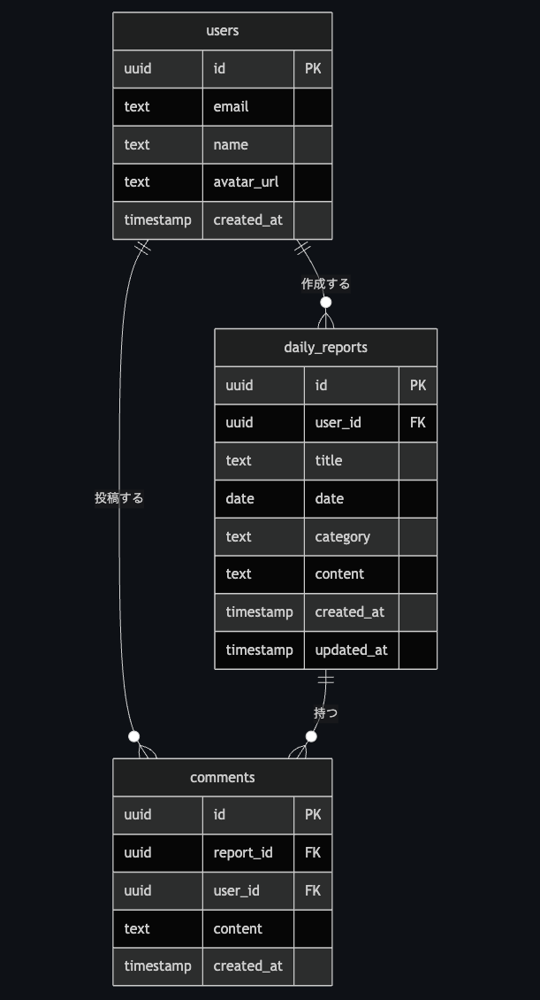

# 📋 Devstep Daily-report

チームの日々の業務内容を記録・共有するWebアプリケーションです。  
メンバーが日報を投稿し、チーム内でコメントを通じてフィードバックを行えます。

> **デモURL:** https://devstep-daily-report-two.vercel.app

---

## スクリーンショット

> スクリーンショットは `docs/screenshots/` フォルダに追加予定

---

## 画面設計（ワイヤーフレーム）

`docs/wireframes.html` をブラウザで開くと、主要画面のワイヤーフレームを確認できます。

```bash
open docs/wireframes.html
```

収録画面：日報一覧 / 日報詳細 / 日報作成 / エラー状態 / ログイン / プロフィール

---

## ER図



> `docs/er-diagram.html` をブラウザで開くと全デバイスで確認できます。

---

## 技術スタック

| カテゴリ | 技術 |
|---|---|
| フレームワーク | Next.js 16（App Router） |
| 言語 | TypeScript（strict: true） |
| データベース / 認証 | Supabase |
| スタイリング | Tailwind CSS + shadcn/ui |
| ストレージ | Supabase Storage（アバター画像） |
| デプロイ | Vercel |
| テスト | Vitest（ユニット）・Playwright（E2E） |
| CI/CD | GitHub Actions |

---

## 機能一覧

### ユーザー認証
- メール / パスワードによる新規登録・ログイン・ログアウト
- パスワードリセット（メール送信）
- 未ログイン時・セッション切れ時の自動リダイレクト

### プロフィール管理
- 表示名の編集
- アバター画像のアップロード・変更（JPG・PNG・WebP / 2MB以下）

### 日報 CRUD
- 日報の作成（タイトル・日付・カテゴリ・本文）
- チーム全員の日報一覧表示
- 日報の詳細表示
- 自分の日報の編集・削除（削除確認ダイアログあり）

### 検索・フィルター
- キーワード検索（タイトル・本文 / デバウンス・日本語IME対応）
- 日付範囲・投稿者・カテゴリによる絞り込み
- フィルター条件のリセット機能

### コメント
- 日報へのコメント投稿・表示（文字数カウンター付き・紙飛行機アイコン）
- 自分のコメントの削除

### バリデーション
- フロントエンド：リアルタイムバリデーション（フォーカスを外したタイミングでエラー表示）
- バックエンド：Supabase RLS による権限チェック・データベース制約

### エラーハンドリング
- 全API呼び出しで例外処理を実装
- エラー発生時にユーザーへメッセージを表示

### UI/UX
- レスポンシブデザイン（375px〜1440px以上のワイドレイアウト対応）
- スマートフォンはハンバーガーメニューで操作
- iOS Safari 日付入力欄のはみ出し対応
- ダークモード / ライトモード切り替え（設定はローカルに保存）
- ボタン2度押し防止・ローディング表示
- 文字数カウンター（上限に近づくとオレンジ色に変化）
- 削除ボタンはホバー時に赤色表示（誤操作防止）
- 日時表示はJST（日本時間）に変換

---

## セットアップ手順

### 必要環境

- Node.js 20 以上
- npm または yarn

### インストール

```bash
# リポジトリをクローン
git clone https://github.com/km20250118/devstep-daily-report.git
cd devstep-daily-report

# 依存パッケージをインストール
npm install
```

### 環境変数の設定

`.env.local` ファイルをプロジェクトルートに作成し、以下を設定してください。

```bash
cp .env.local.example .env.local
```

```env
NEXT_PUBLIC_SUPABASE_URL=your_supabase_project_url
NEXT_PUBLIC_SUPABASE_ANON_KEY=your_supabase_anon_key
```

### 開発サーバーの起動

```bash
npm run dev
```

ブラウザで [http://localhost:3000](http://localhost:3000) を開いてください。

---

## 環境変数

| 変数名 | 説明 | 必須 |
|---|---|---|
| `NEXT_PUBLIC_SUPABASE_URL` | Supabase プロジェクトの URL | ✅ |
| `NEXT_PUBLIC_SUPABASE_ANON_KEY` | Supabase の公開 anon キー | ✅ |

Supabase プロジェクトの作成方法は [Supabase 公式ドキュメント](https://supabase.com/docs) を参照してください。

---

## テスト実行方法

```bash
# ユニットテスト（Vitest）
npm run test

# ユニットテスト（ウォッチモード）
npm run test:watch

# E2Eテスト（Playwright）- 別ターミナルで npm run dev を起動してから実行
npm run test:e2e

# カバレッジ計測
npm run test:coverage
```

### テスト構成

| 種別 | ファイル | 内容 |
|---|---|---|
| ユニットテスト | `src/test/unit/validation.test.ts` | バリデーション関数 15件 |
| E2Eテスト | `tests/daily-report.spec.ts` | ログイン・日報作成・詳細表示・リダイレクト 4件 |

---

## CI/CD

GitHub Actions により以下が自動実行されます。

| トリガー | 実行内容 |
|---|---|
| `main` へのプッシュ | ユニットテスト・ビルド・型チェック |
| PR作成時 | ユニットテスト・ビルド・型チェック |
| `main` マージ時 | Vercel へ自動デプロイ |

設定ファイル: `.github/workflows/ci.yml`

---

## デプロイ方法

本プロジェクトは Vercel にデプロイします。

1. [Vercel](https://vercel.com) にログインし、リポジトリを連携
2. 環境変数（`NEXT_PUBLIC_SUPABASE_URL`・`NEXT_PUBLIC_SUPABASE_ANON_KEY`）を Vercel の設定画面で登録
3. `main` ブランチへのマージで自動デプロイされます

---

## 開発プロセス

詳細は [DEVELOPMENT.md](./DEVELOPMENT.md) を参照してください。

### 工夫した点
- ユーザー目線でのUI/UX改善（削除ボタンの赤ホバー・文字数カウンター・ローディング表示）
- iPhoneとPCの両方で動作確認し、レスポンシブの細かい問題を修正
- ダークモードをアプリ内で切り替えられるようにし、設定をローカルに保存

### 苦労した点
- Next.js 16の破壊的変更（`params` の非同期化）への対応
- iOS Safariの独自仕様（日付入力・カレンダーアイコン）への対応
- ハイドレーションエラーの原因特定と修正

### 今後の改善案
- ページネーション実装（現在は全件取得）
- プッシュ通知（新しいコメント時）
- 日報のCSVエクスポート機能
- テストカバレッジのさらなる向上

---

## ライセンス

MIT
