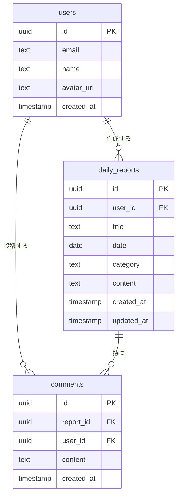

# ER図：チーム日報管理システム



---

## テーブル定義

### users
> Supabase Auth が管理するユーザー情報。`auth.users` を参照する `profiles` テーブルとして実装する。

| カラム | 型 | 制約 | 説明 |
|---|---|---|---|
| id | uuid | PK / auth.users.id と一致 | ユーザーID |
| email | text | NOT NULL | メールアドレス |
| name | text | NOT NULL | 表示名 |
| avatar_url | text | NULL可 | アバター画像URL |
| created_at | timestamp | NOT NULL, DEFAULT now() | 登録日時 |

### daily_reports

| カラム | 型 | 制約 | 説明 |
|---|---|---|---|
| id | uuid | PK, DEFAULT gen_random_uuid() | 日報ID |
| user_id | uuid | FK → users.id, NOT NULL | 投稿者 |
| title | text | NOT NULL, 50文字以内 | タイトル |
| date | date | NOT NULL | 業務日付 |
| category | text | NOT NULL | カテゴリ（開発/会議/その他） |
| content | text | NOT NULL, 2000文字以内 | 本文 |
| created_at | timestamp | NOT NULL, DEFAULT now() | 作成日時 |
| updated_at | timestamp | NOT NULL, DEFAULT now() | 更新日時 |

### comments

| カラム | 型 | 制約 | 説明 |
|---|---|---|---|
| id | uuid | PK, DEFAULT gen_random_uuid() | コメントID |
| report_id | uuid | FK → daily_reports.id, NOT NULL | 対象日報 |
| user_id | uuid | FK → users.id, NOT NULL | 投稿者 |
| content | text | NOT NULL, 500文字以内 | コメント本文 |
| created_at | timestamp | NOT NULL, DEFAULT now() | 投稿日時 |

---

## RLS ポリシー方針

| テーブル | SELECT | INSERT | UPDATE | DELETE |
|---|---|---|---|---|
| users | 全員 | 本人のみ | 本人のみ | 不可 |
| daily_reports | 全員 | 認証済みユーザー | 本人のみ | 本人のみ |
| comments | 全員 | 認証済みユーザー | 不可 | 本人のみ |
```
