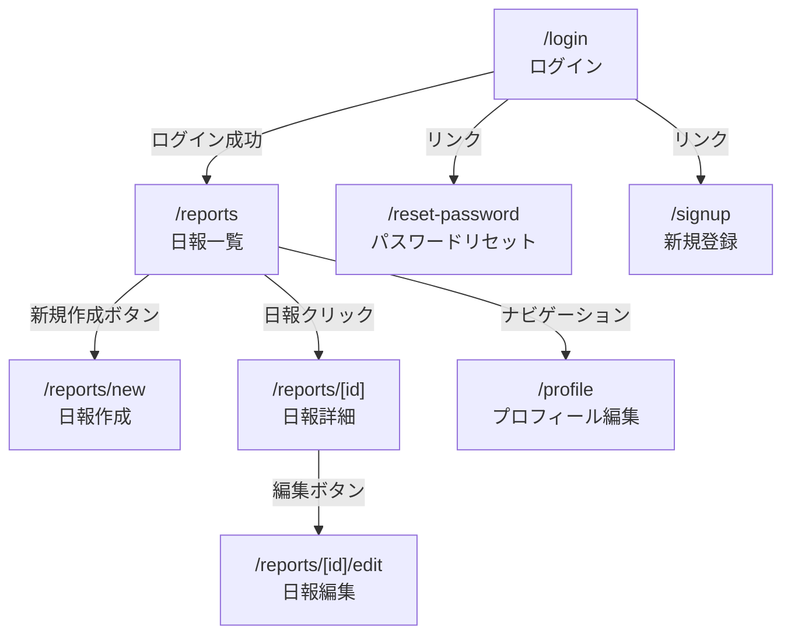

# 画面設計書：チーム日報管理システム

---

## 画面遷移図

---

## 画面一覧

| # | 画面名 | URL | 概要 |
|---|---|---|---|
| 1 | ログイン | `/login` | メール・PW入力、新規登録・PW忘れへのリンク |
| 2 | 新規登録 | `/signup` | メール・PW・名前の入力フォーム |
| 3 | パスワードリセット | `/reset-password` | メールアドレス入力でリセットメール送信 |
| 4 | 日報一覧 | `/reports` | 全メンバーの日報カード一覧・検索・フィルター |
| 5 | 日報作成 | `/reports/new` | タイトル・日付・カテゴリ・内容のフォーム |
| 6 | 日報詳細 | `/reports/[id]` | 本文全文・コメント一覧・編集削除ボタン |
| 7 | 日報編集 | `/reports/[id]/edit` | 作成フォームと同じレイアウト（既存値入力済み） |
| 8 | プロフィール編集 | `/profile` | 名前・アバター画像の変更フォーム |

---

## 各画面の詳細

### 1. ログイン（`/login`）

**目的:** 既存ユーザーの認証

**UI要素:**
- サービス名・キャッチコピー（ヘッダー）
- メールアドレス入力フィールド
- パスワード入力フィールド
- ログインボタン（Primary）
- 「パスワードを忘れた場合」リンク → `/reset-password`
- 「新規登録」リンク → `/signup`

**バリデーション:**
- 必須チェック（メール・PW）
- メール形式チェック
- エラー時：各フィールド下にエラーメッセージ表示

---

### 2. 日報一覧（`/reports`）

**目的:** チーム全員の日報を一覧表示・検索・絞り込み

**UI要素:**
- トップバー（サービス名・ナビゲーション・ログアウト）
- 「日報を作成」ボタン（右上、Primary）
- 検索バー（キーワード・開始日・終了日）
- フィルター（投稿者絞り込み・カテゴリ絞り込み）
- 日報カード一覧
  - アバター・タイトル・カテゴリバッジ・日付
  - 本文冒頭（100文字）
  - 投稿者名・コメント数
- ページネーション（10件/ページ）

**カテゴリバッジ色分け:**
- 開発 → 緑
- 会議 → 黄
- その他 → グレー

---

### 3. 日報詳細（`/reports/[id]`）

**目的:** 日報の本文全文表示・コメント閲覧・投稿

**UI要素:**
- 「一覧へ戻る」リンク
- タイトル（h1相当）
- メタ情報行（アバター・投稿者名・カテゴリ・日付）
- 編集ボタン・削除ボタン（**自分の日報のみ表示**）
- 本文（フルテキスト）
- 作成日時・更新日時
- 区切り線
- コメントセクション
  - コメント数表示
  - コメント一覧（アバター・名前・投稿日時・本文・自分のコメントのみ削除ボタン）
  - コメント入力フォーム + 送信ボタン

---

### 4. 日報作成（`/reports/new`）

**目的:** 新しい日報の作成

**UI要素:**
- 「キャンセル」リンク（← 一覧へ戻る）
- フォームフィールド
  - タイトル（テキスト入力・50文字制限・文字数カウンター表示）
  - 日付（Date picker・デフォルト今日）
  - カテゴリ（Select：開発 / 会議 / その他）
  - 内容（Textarea・2000文字制限・文字数カウンター表示）
- バリデーションエラーメッセージ（各フィールド下）
- 「キャンセル」ボタン（Secondary）
- 「作成する」ボタン（Primary）

---

### 5. 日報編集（`/reports/[id]/edit`）

**目的:** 既存日報の編集（自分の日報のみ）

**UI要素:** 日報作成と同じレイアウト。各フィールドに既存値が入力済みの状態で表示。  
「作成する」ボタンの代わりに「更新する」ボタン（Primary）。

---

### 6. プロフィール編集（`/profile`）

**目的:** 表示名・アバター画像の変更

**UI要素:**
- 現在のアバター画像（プレビュー）
- アバター画像アップロードボタン
- 表示名（テキスト入力）
- 「保存する」ボタン（Primary）
- メールアドレス表示（読み取り専用・変更不可）

---

## デザイン方針

- **カラー:** ニュートラルな業務ツールとして Tailwind のグレー系をベースに使用
- **コンポーネント:** shadcn/ui の Button・Input・Select・Card を活用
- **レスポンシブ:** スマホ（375px〜）はシングルカラム、デスクトップはサイドバーまたは2カラム
- **フォント:** システムフォント（tailwind デフォルト）
- **エラー状態:** 赤枠＋エラーメッセージでリアルタイム表示
